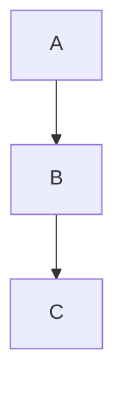

# Zenn Markdown 記法リファレンス

Zenn でサポートされる Markdown 記法の網羅リファレンス。SKILL.md から「正確な書式を確認したいとき」に参照される。出典は [Zenn Markdown 記法ガイド](https://zenn.dev/zenn/articles/markdown-guide) と [Zenn CLI ガイド](https://zenn.dev/zenn/articles/zenn-cli-guide)。

## 目次

- [標準 Markdown](#標準-markdown)
  - 見出し / リスト / リンク / 画像 / 強調 / 引用 / コード / テーブル / 水平線 / HTML コメント
- [Zenn 独自記法](#zenn-独自記法)
  - [メッセージ枠 `:::message`](#メッセージ枠-message)
  - [アコーディオン `:::details`](#アコーディオン-details)
  - [コードブロック（ファイル名・diff）](#コードブロックファイル名diff)
  - [数式 KaTeX](#数式-katex)
  - [画像のサイズ指定とキャプション](#画像のサイズ指定とキャプション)
  - [脚注](#脚注)
  - [リンクカード](#リンクカード)
  - [埋め込み（Tweet / YouTube / GitHub / 他）](#埋め込みtweet--youtube--github--他)
  - [mermaid 図](#mermaid-図)
- [frontmatter（参考・対象外）](#frontmatter参考対象外)
- [ファイル配置・スラッグ規則（参考）](#ファイル配置スラッグ規則参考)

---

## 標準 Markdown

### 見出し

```
# H1
## H2
### H3
#### H4
```

H1 はタイトルとして frontmatter 側に書くため、本文は `## H2` から始めるのが推奨される（アクセシビリティの観点）。

### リスト

```
- 箇条書き
- もう一つ
  - ネスト

1. 番号付き
2. もう一つ
```

### リンク

```
[テキスト](https://example.com)
```

### 画像

```

```

サイズ指定とキャプションは [画像のサイズ指定とキャプション](#画像のサイズ指定とキャプション) を参照。

### 強調・装飾

```
*斜体* または _斜体_
**太字** または __太字__
~~打ち消し線~~
`インラインコード`
```

### 引用

```
> 引用文
> 続き
```

### コードブロック

````
```
言語指定なし
```

```ts
const x: number = 1;
```
````

ファイル名・diff の拡張は [コードブロック（ファイル名・diff）](#コードブロックファイル名diff) を参照。

### テーブル

```
| 列1 | 列2 |
| --- | --- |
| a   | b   |
```

整列は `:---`（左）、`:---:`（中央）、`---:`（右）。

### 水平線

```
---
```

### HTML コメント

```
<!-- これはレンダリングされない -->
```

---

## Zenn 独自記法

### メッセージ枠 `:::message`

通常メッセージ:

```
:::message
通常のメッセージです。
:::
```

警告系メッセージ:

```
:::message alert
警告のメッセージです。
:::
```

修飾子は `alert` のみ。空白で区切る。終了は `:::`。

### アコーディオン `:::details`

```
:::details タイトル
折り畳まれる中身。Markdown が使える。
:::
```

`:::message` などをネストする場合、外側のコロンを 4 つ以上に増やして境界を明示する:

```
::::details タイトル
:::message
ネストしたメッセージ
:::
::::
```

### コードブロック（ファイル名・diff）

ファイル名表示:

````
```ts:src/foo.ts
const x: number = 1;
```
````

`言語:ファイル名` の形でコロン区切り。言語指定なしのまま `:filename` だけ書きたい場合は `:filename.txt` のように書く（言語ハイライトはなくなるがファイル名は表示される）。

diff 表示:

````
```diff ts
- const a = 1;
+ const a = 2;
  const b = 3;
```
````

`diff <言語>` で書くと、`+` `-` のプレフィックスで色付きハイライトされ、ベース言語のシンタックスハイライトも維持される。

### 数式 (KaTeX)

インライン:

```
これは $a \ne 0$ である。
```

ブロック:

```
$$
\int_{-\infty}^{\infty} e^{-x^2}\,dx = \sqrt{\pi}
$$
```

レンダリングは KaTeX。LaTeX のすべての記法ではなく KaTeX 互換のサブセットなので、長い数式はプレビューで確認する。

### 画像のサイズ指定とキャプション

サイズ指定は `=幅x高さ` の形を URL 直後にスペース区切りで入れる。片方だけでよい:

```


```

キャプションは画像の直後の段落を `*…*`（または `_…_`）で囲む:

```

*画像のキャプション*
```

### 脚注

```
本文中の参照[^1]。複数も可[^note]。

[^1]: 脚注の本文。
[^note]: ラベル名でも書ける。
```

脚注ラベルは半角英数字。本文の表記順とは独立に、文書末でまとめて定義する形でもよい。

### リンクカード

単独行に裸 URL を置くとリンクカードになる:

```
本文の段落。

https://example.com

次の段落。
```

明示的に書く形:

```
@[card](https://example.com)
```

既に `[テキスト](url)` 形式のインラインリンクは、それ自体が文中で意味を持っているのでカード化しないこと。

### 埋め込み（Tweet / YouTube / GitHub / 他）

サービスは「裸 URL のままで埋め込みになる」「`@[…](URL)` で URL を渡す」「`@[…](id)` で id 抽出が必要」の 3 種類に分かれる。

| サービス | 必要な書き方 | 補足 |
| --- | --- | --- |
| Twitter / X | 単独行 URL のまま | `https://twitter.com/<user>/status/<id>` または `https://x.com/...` |
| YouTube | 単独行 URL のまま | `https://www.youtube.com/watch?v=<id>` / `https://youtu.be/<id>` |
| GitHub（ファイル） | 単独行 URL のまま | `https://github.com/<owner>/<repo>/blob/<sha-or-branch>/<path>`。末尾に `#L10-L20` で行範囲ハイライト |
| CodePen | `@[codepen](URL)` | URL をそのまま渡す |
| JSFiddle | `@[jsfiddle](URL)` | 同上 |
| StackBlitz | `@[stackblitz](URL)` | 同上 |
| Figma | `@[figma](URL)` | 共有リンクの URL を渡す |
| GitHub Gist | `@[gist](URL)` | gist のページ URL |
| SpeakerDeck | `@[speakerdeck](<embed_id>)` | URL は使えない。oEmbed (`https://speakerdeck.com/oembed.json?url=<URL>`) のレスポンス HTML 内 `/player/<32桁hex>` から `embed_id` を抜く |
| SlideShare | `@[slideshare](<key>)` | 埋め込みコードに含まれる `data-key` を使う |
| その他不明 URL | 単独行 URL のまま | Zenn のリンクカードとしてレンダリングされる |

このスキルではサービス判別と URL→id 抽出を `scripts/zenn-embed.sh` に集約している（SpeakerDeck の oEmbed もこのスクリプト内で叩く）。手で書く場合は上の表を参照。

例:

```
@[codepen](https://codepen.io/team/codepen/pen/PNaGbb)
@[figma](https://www.figma.com/file/<id>/<slug>)
@[gist](https://gist.github.com/<user>/<id>)
@[jsfiddle](https://jsfiddle.net/<user>/<id>/)
@[stackblitz](https://stackblitz.com/edit/<id>)
@[speakerdeck](4d38ba718577441bb8c97392c3cdb0cd)
```

### mermaid 図

````

````

制限:

- 約 2000 文字まで
- チェイン演算子（`A --> B --> C` のように `-->` で繋ぐもの）は最大 10 個程度

長い図は分割するか画像化する。

---

## frontmatter（参考・対象外）

このスキルは frontmatter を編集しないが、ユーザーから問い合わせを受けたときのために仕様を残しておく。

記事の場合:

```yaml
---
title: ""              # 必須
emoji: "😸"            # アイキャッチ絵文字 1 文字、必須
type: "tech"           # tech (技術記事) / idea (アイデア記事)
topics: ["typescript", "react"]  # 最大 5 個
published: true        # false で下書き
published_at: 2026-04-26 09:00   # JST。一度設定したら変更不可
---
```

本のチャプター:

```yaml
---
title: "チャプターのタイトル"
free: true  # 有料本で無料公開する場合のみ
---
```

`published_at` は変更不可。日付のみ書いた場合は時刻が `00:00` になる。

## ファイル配置・スラッグ規則（参考）

```
articles/
  <article-slug>.md
books/
  <book-slug>/
    config.yaml
    cover.png  (または .jpeg)
    <chapter-slug>.md
```

- 記事スラッグ: `[a-z0-9_-]{12,50}`
- 本のスラッグ: `[a-z0-9_-]{12,50}`
- チャプタースラッグ: `[a-z0-9_-]{1,50}`。`1.intro.md` のように番号プレフィックスで順序を制御する形式もサポート
